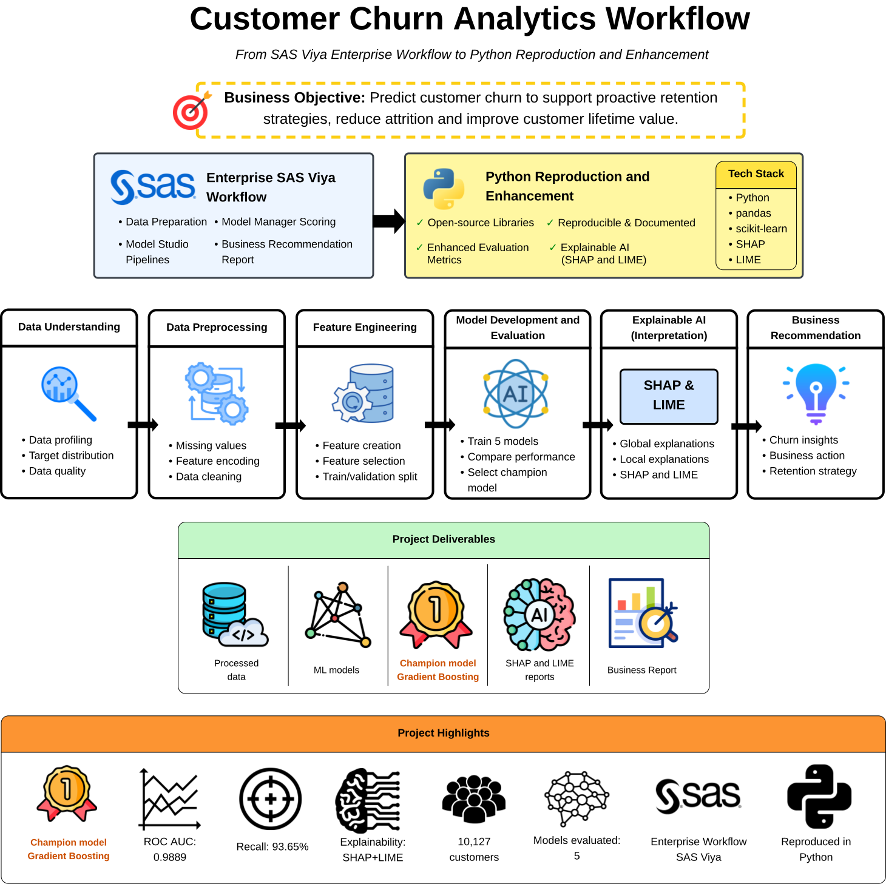
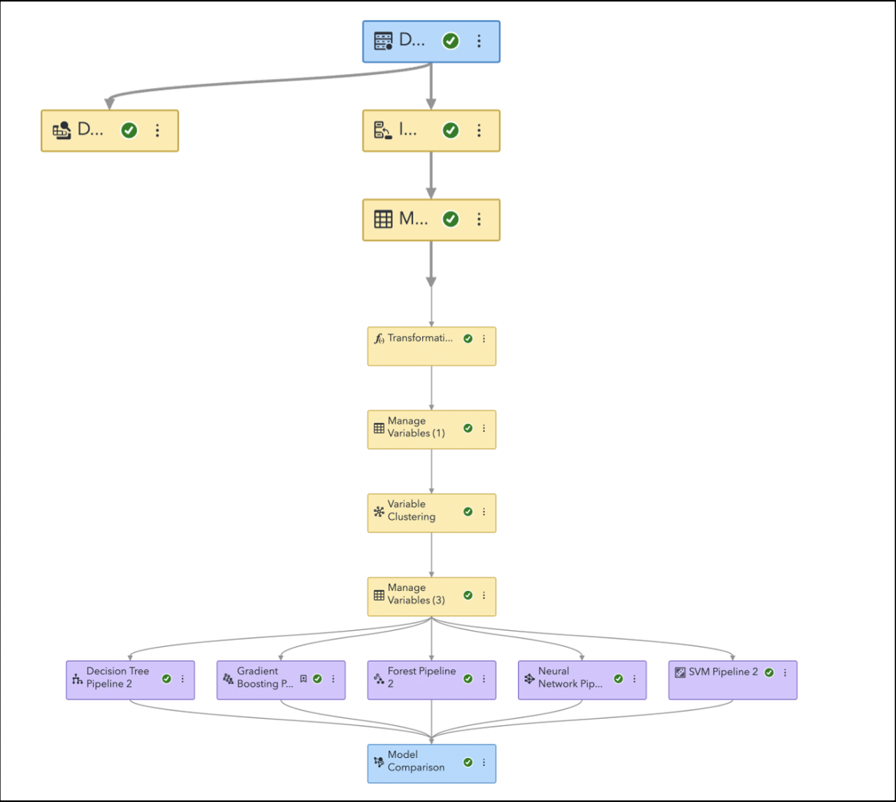
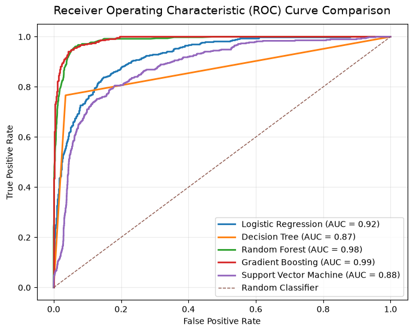
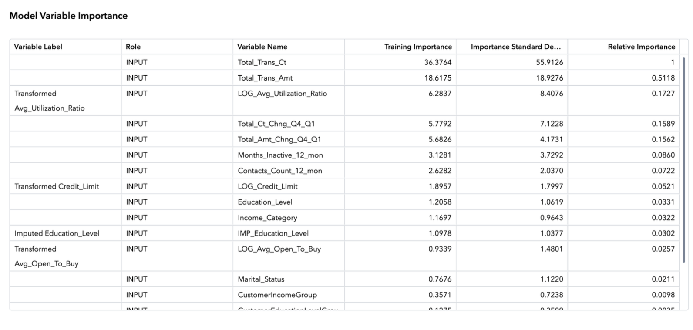
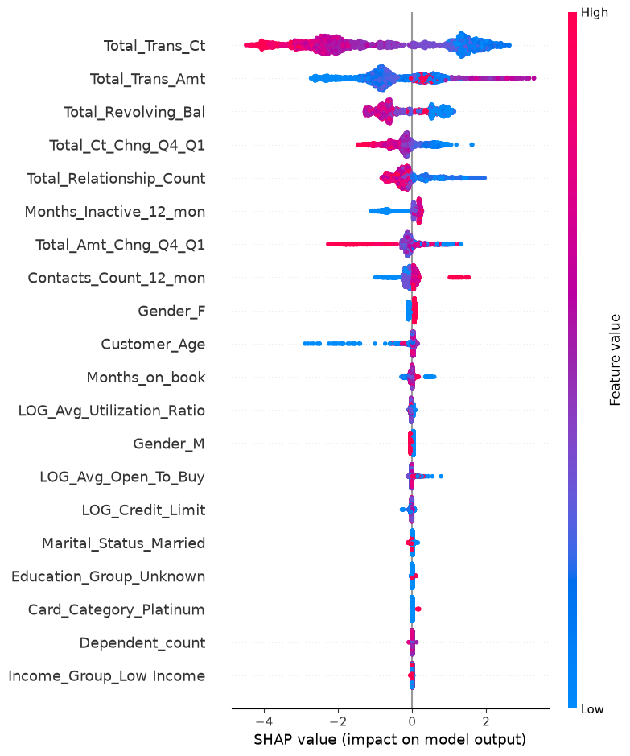
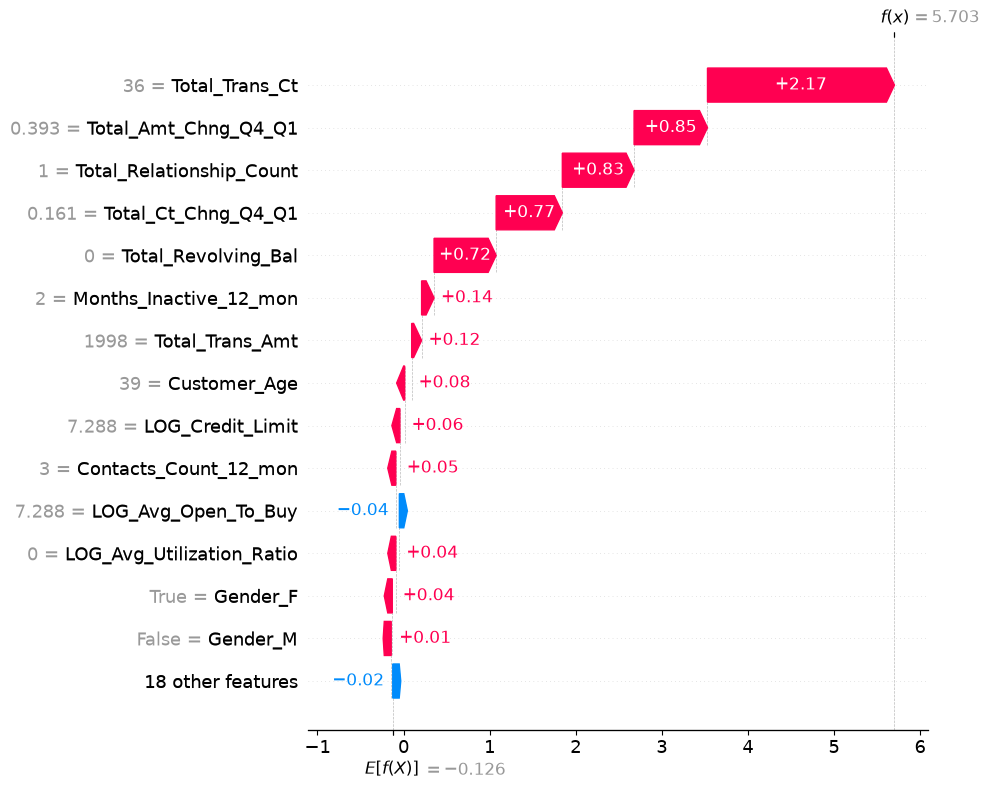
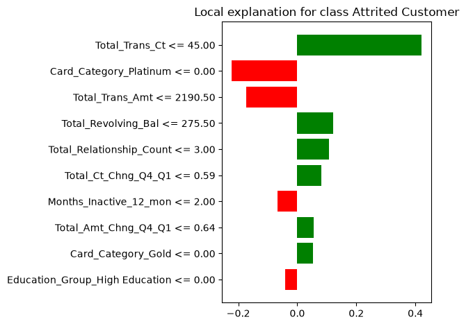
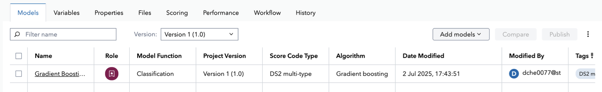

# Customer Churn Analytics using Machine Learning

Reproducing and enhancing an analytics workflow originally implemented using the enterprise platform SAS Viya focusing on customer churn using Python, Explainable AI (SHAP & LIME), and business-driven machine learning.


## 🚀 Project Highlights

| Item | Result |
|------|--------|
| 🎯 Business Problem | Predict customer churn for retail banking customers |
| 🏆 Champion Model | Gradient Boosting |
| 📈 ROC AUC | **0.9889** |
| 🎯 Recall | **93.65%** |
| 🧠 Explainability | SHAP & LIME |
| 🏦 Original Platform | SAS Viya |
| 🐍 Reproduced In | Python |

---

## ⭐ Why This Repository?

Unlike a typical machine learning project, this repository reproduces an analytics workflow originally implemented using the enterprise platform **SAS Viya Model Studio**, then enhances it using modern open-source Python tools.

The project demonstrates an end-to-end analytical machine learning workflow, from enterprise data preparation and model development to explainability and business recommendations.

- Enterprise data preparation using SAS Viya
- Python reproduction of the entire modelling pipeline
- Multi-model comparison and champion model selection
- Explainable AI using SHAP and LIME
- Business-focused recommendations for customer retention
- Reproducible notebook-based workflow with version control

Rather than replacing SAS Viya, this repository demonstrates how an analytics workflow originally implemented in an enterprise platform can be reproduced, extended, and documented using an open-source Python ecosystem.

---

## 📊 Project Workflow

The following diagram summarises the complete analytics workflow, from the original enterprise platform SAS Viya implementation to the enhanced Python-based machine learning pipeline.

<p align="center">
  
</p>

---

## 📒 Notebook Guide

| Notebook | Description |
|-----------|-------------|
| **01 – Data Understanding and Quality** | Data exploration, quality assessment and churn analysis |
| **02 – Data Preparation** | Missing value handling, encoding and data cleaning |
| **03 – Feature Engineering** | Feature engineering and preparation of modelling datasets |
| **04 – Model Development and Evaluation** | Model training, evaluation and champion model selection |
| **05 – Model Interpretation using SHAP and LIME** | Explainable AI using SHAP and LIME |
| **06 – Business Recommendations and Conclusion** | Business insights, deployment considerations and future recommendations |

---

## Project Overview

Customer churn is one of the most significant challenges faced by financial institutions. Customer churn can reduce recurring value and increase the need for replacement acquisition, making early identification of at-risk customers commercially important for improving profitability and long-term customer loyalty.

This project develops an end-to-end customer churn analytics pipeline designed to estimate customer churn risk using supervised machine learning.

Unlike a typical university assignment, this repository reproduces and extends an analytics workflow originally implemented using the enterprise platform SAS Viya by implementing the entire analytics pipeline in **Python**, while improving reproducibility, model explainability, and documentation.

---

## Dataset

| Attribute | Value |
|-----------|-------|
| Dataset | Credit Card Customers |
| Source | Kaggle |
| Records | 10,127 |
| Target | `Attrition_Flag` |
| Problem Type | Binary Classification |
| Positive Class | Attrited Customer |
| Leakage Handling | Naive Bayes classifier output columns removed prior to modelling |

---

## 📄 Original Enterprise Documentation

The Python implementation in this repository is based on an enterprise analytics workflow originally developed using **SAS Viya**.

The original project documentation is included for reference:

- 📘 [Project Proposal](docs/project_proposal.pdf)
- 📙 [Data Preparation Report](docs/data_preparation_report.pdf)
- 📗 [Predictive Modelling Report](docs/predictive_modelling_report.pdf)

These reports document the original SAS Viya implementation, including enterprise data preparation, model development, champion model selection, and business recommendations that were later reproduced and enhanced using Python.

---

## 🏦 Enterprise SAS Viya Workflow

Before reproducing the workflow in Python, the complete analytics pipeline was originally developed using **SAS Viya Model Studio** as part of an enterprise predictive modelling workflow.

The Python implementation follows the same modelling lifecycle while extending it with modern explainability techniques and improved reproducibility.

<p align="center">
    
</p>

The original SAS implementation included:

- Data preparation
- Feature engineering
- Variable clustering
- Model comparison
- Champion model selection
- Model registration

The Python implementation preserves this workflow while adding SHAP, LIME, richer evaluation metrics, and notebook-based reproducibility.

---

## 🔄 Enterprise SAS Viya → Python Reproduction

| Enterprise SAS Viya | Python Implementation |
|---------------------|-----------------------|
| Data Preparation Node | Notebook 02 |
| Feature Engineering Pipeline | Notebook 03 |
| Model Studio | Scikit-Learn |
| Variable Selection / Clustering | Feature Engineering |
| Model Comparison | Cross-model Evaluation |
| Champion Model | Gradient Boosting |
| Variable Importance | SHAP + Feature Importance |
| Model Manager Registration and Scoring| Serialized Model Artifact for Future Deployment |
| Model Governance and Life Cycle Management | Planned Through Versioning, CI/CD, and Monitoring |
| Business Report | Notebook 06 |

The objective of this repository was not simply to rebuild an existing workflow, but to demonstrate how an enterprise analytics solution can be migrated to an open-source, reproducible machine learning pipeline while maintaining business interpretability.

---

### SAS Viya and Python Results

Both implementations selected Gradient Boosting as the strongest model. However, their performance values should not be interpreted as a direct benchmark because the preprocessing, feature-selection strategy, model configuration, and evaluated model set differ between the SAS Viya and Python workflows.

| Implementation | Champion | ROC AUC |
|---|---|---:|
| SAS Viya | Gradient Boosting | 0.9802 |
| Python | Gradient Boosting | 0.9889 |

---

## Machine Learning Models

Five supervised learning algorithms were evaluated.

| Model | Purpose |
|--------|----------|
| Logistic Regression | Linear baseline classifier |
| Decision Tree | Interpretable tree-based model |
| Random Forest | Ensemble learning |
| Gradient Boosting | Champion model |
| Support Vector Machine | Maximum-margin classifier |

---

### Champion Model

Gradient Boosting was selected because it achieved the strongest overall balance of discrimination and churn detection, with the highest ROC AUC and recall, as well as the best F1-score among the evaluated models. Recall was particularly important because missed churners represent customers who may leave without receiving an intervention.

| Metric | Score |
|---------|------:|
| Accuracy | **95.43%** |
| Precision | **80.89%** |
| Recall | **93.65%** |
| F1-score | **86.80%** |
| ROC AUC | **0.9889** |

### 📈 ROC Curve Comparison

<p align="center">
  
</p>

Gradient Boosting consistently outperformed the remaining machine learning algorithms, achieving the highest ROC AUC (**0.9889**).

The curve shows strong sensitivity across low false-positive-rate regions. An operational threshold would still need to be selected according to intervention cost, retention capacity, and the relative cost of missed churners.

This makes the model well suited for identifying high-risk customers early, enabling proactive customer retention strategies.

## 🧠 Explainable AI

Traditional enterprise workflows often rely on feature importance rankings to explain model behaviour.

This repository extends that capability using modern Explainable AI techniques that provide both global and local model interpretations.

The explainability workflow progresses from traditional model feature importance to SHAP and LIME for greater transparency and stakeholder trust.

### Enterprise Variable Importance (SAS)

<p align="center">
    
</p>

The original SAS workflow identified transaction behaviour as the dominant predictor of customer churn.

---

### SHAP Summary Plot

<p align="center">
  
</p>

The SHAP summary plot reveals that **customer behaviour**, rather than demographic characteristics, drives the majority of churn predictions.

The global SHAP analysis identifies `Total_Trans_Ct`, `Total_Trans_Amt`, and `Total_Revolving_Bal` as the three most influential predictors. The number of banking relationships and changes in transaction activity also contribute meaningfully to churn predictions.

This indicates that declining customer engagement is a stronger predictor of churn than static customer demographics.
---

### SHAP Waterfall Plot

<p align="center">
  
</p>

The waterfall plot explains an individual customer's prediction by showing how each feature contributes to the final churn probability.

For this customer, a **low transaction count**, **reduced spending**, and **limited banking relationships** collectively pushed the prediction towards the churn class.

This level of local interpretability enables relationship managers to understand *why* a customer has been identified as high risk and supports personalised intervention strategies.

---

### LIME Local Explanation

<p align="center">
  
</p>

LIME provides an independent local explanation of the same prediction using a surrogate interpretable model.

The explanation closely aligns with SHAP by highlighting low transaction activity and reduced customer engagement as the primary drivers of churn.

The agreement reduces reliance on a single explanation method and strengthens confidence that the highlighted local drivers are stable across two complementary approaches.

---

### 🏆 Champion Model Lifecycle

The enterprise workflow concluded with deployment of the champion model into **SAS Model Manager** for operational scoring.

<p align="center">
    
</p>

In this repository, the selected Gradient Boosting model is exported as a serialized Python model (`gradient_boosting_model.pkl`) for future deployment into production environments such as REST APIs, Streamlit dashboards, or cloud platforms.

This establishes a deployment-ready model artifact, while API serving, versioning, and monitoring remain future engineering work.

---

## Key Findings

The analyses consistently demonstrated that:

- Transaction behaviour is substantially more predictive than demographic characteristics.
- Low transaction count is the strongest indicator of customer churn.
- Reduced customer spending increases churn probability.
- Customers with fewer banking relationships are significantly more likely to churn.
- SHAP and LIME independently produced highly consistent explanations, increasing confidence in the model's robustness.

---

## Business Recommendations

The analysis suggests several data-driven retention strategies.

| Model Finding | Recommended Action |
|---------------|--------------------|
| Declining transaction count | Trigger early retention campaigns |
| Reduced transaction amount | Offer personalised spending incentives |
| Few banking relationships | Recommend relevant cross-selling opportunities |
| Reduced customer engagement | Prioritise proactive relationship-manager outreach |

These recommendations are intended to guide customer retention initiatives and should be validated through controlled business experiments before large-scale deployment.

---

## Lessons Learned

Developing this project provided several practical insights into enterprise analytics workflows.

- High predictive performance alone is insufficient without model interpretability.
- Reproducing proprietary analytics workflows in Python improves transparency and reproducibility.
- Explainable AI enables technical model outputs to be translated into business decisions.
- Organising machine learning projects into modular notebooks improves maintainability and collaboration.

---

## 🛠 Technologies

| Area | Technologies |
|------|--------------|
| 💻 **Programming** | Python 3.12 |
| 📊 **Data Analysis** | Pandas, NumPy |
| 🤖 **Machine Learning** | Scikit-learn |
| 🧠 **Explainable AI** | SHAP, LIME |
| 📈 **Visualisation** | Matplotlib |
| 💾 **Model Persistence** | Joblib |
| 🧪 **Development** | Jupyter Notebook, VS Code |
| 🌐 **Version Control** | Git, GitHub |

---

## 🚀 Future Roadmap

- Add automated tests and GitHub Actions validation.
- Package preprocessing and prediction in a single deployable pipeline.
- Expose churn probability through a lightweight FastAPI service.

--- 

## Repository Structure

```text 
customer-churn-analytics/
├── data/
│   ├── raw/
│   └── processed/
├── docs/
│   ├── project_proposal.pdf
│   ├── data_preparation_report.pdf
│   └── predictive_modelling_report.pdf
├── images/
│   ├── churn_workflow.svg
│   ├── roc_curve.png
│   ├── shap_summary.png
│   ├── shap_waterfall.png
│   ├── lime_explanation.png
│   ├── sas_pipeline2.png
│   ├── sas_variable_importance.png
│   └── sas_model_manager.png
├── models/
│   └── gradient_boosting_model.pkl
├── notebooks/
│   ├── 01_data_understanding_and_quality.ipynb
│   ├── 02_data_preparation.ipynb
│   ├── 03_feature_engineering.ipynb
│   ├── 04_model_development_and_evaluation.ipynb
│   ├── 05_model_interpretation_shap_lime.ipynb
│   └── 06_business_recommendations_and_conclusion.ipynb
├── src/
├── .gitignore
├── requirements.txt
├── LICENSE
└── README.md
```

---

## 🔄 Installation and Reproducing Results

```bash
git clone https://github.com/darrenchenhw0212/customer-churn-analytics.git
cd customer-churn-analytics

python3.12 -m venv .venv
source .venv/bin/activate        # macOS/Linux
# .venv\Scripts\activate         # Windows

pip install -r requirements.txt
jupyter notebook
```

To reproduce the complete analytics workflow, execute the notebooks from the repository root in numerical order:

```text
01_data_understanding.ipynb
        ↓
02_data_preprocessing.ipynb
        ↓
03_data_preparation.ipynb
        ↓
04_model_development_and_evaluation.ipynb
        ↓
05_model_interpretation.ipynb
        ↓
06_business_recommendations_and_conclusion.ipynb
```
The workflow produces processed datasets under data/processed/ and the trained model artifact under models/.

Successful execution generates:

- Processed datasets under `data/processed/`
- Trained Gradient Boosting model under `models/`
- ROC curve visualisations
- Confusion matrices
- SHAP plots
- LIME explanations

---

## Limitations

- The analysis uses a single public, static dataset and has not been validated on recent banking data.
- Performance was measured on a held-out validation set rather than an external or temporal test set.
- Model explanations describe predictive associations and should not be interpreted as causal effects.
- The current model artifact is not yet exposed through a production inference service.
- Retention costs, customer lifetime value, and intervention capacity were not available for business-threshold optimisation.

---

## Acknowledgements

- Kaggle Credit Card Customers Dataset
- SAS Viya Model Studio
- SHAP
- LIME
- Scikit-Learn

---

## License

This project is released under the MIT License.